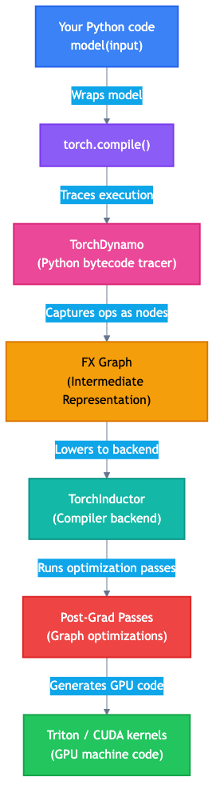

# How `torch.compile` turns Python into GPU code

## What this document covers

This document explains the full journey that your Python model code
takes from a high-level `model(input)` call all the way down to
actual GPU kernel execution. Understanding this pipeline is
essential for understanding the bug we fixed and why compiler
passes exist in the first place.



## The problem `torch.compile` solves

When you write PyTorch code like this:

```python
q = rms_norm(q)
k = rms_norm(k)
q, k = rotary_embedding(positions, q, k)
```

Without `torch.compile`, each of those lines launches a separate
GPU kernel. Each kernel launch has overhead:

1. The CPU must tell the GPU what to do (the "launch" itself,
   roughly 5-10 microseconds per launch).
2. The GPU must read its input tensors from high-bandwidth memory
   (HBM), do the computation, then write results back to HBM.
3. The next kernel reads those results back from HBM again.

That repeated read-write cycle to HBM is the bottleneck. GPU
compute is fast. GPU memory bandwidth is the limiting factor for
many operations. This is called being **memory-bound**.

`torch.compile` solves this by analyzing your entire computation
graph and **fusing** multiple operations into a single GPU kernel.
Inside a fused kernel, intermediate values stay in fast on-chip
memory (registers and shared memory) instead of taking the slow
round trip to HBM.

## The six stages

### Stage 1: `torch.compile(model)`

When you call `torch.compile(model)`, PyTorch does not immediately
compile anything. It returns a wrapper that will compile lazily on
the first real call. The compilation only happens when actual data
flows through the model.

```python
compiled_model = torch.compile(model)
# Nothing compiled yet

output = compiled_model(input)
# NOW compilation happens (on first call)
# Subsequent calls reuse the compiled version
```

### Stage 2: TorchDynamo (the tracer)

TorchDynamo is a Python bytecode-level tracer. It intercepts
Python bytecode (the instructions your `.py` files compile to) and
records every tensor operation that happens during execution.

It does not run your model in the traditional sense. Instead, it
*traces* through it with symbolic inputs, capturing every
operation as a node in a graph. Think of it like recording a
recipe: instead of cooking the meal, you write down every step.

Key concepts:

- **Guard**: a condition that must be true for the compiled code
  to be valid. For example, "input has shape [5, 2048]". If the
  guard fails on a later call, PyTorch recompiles.
- **Graph break**: if Dynamo encounters Python code it cannot
  trace (like a data-dependent `if` statement), it "breaks" the
  graph into segments. Each segment is compiled separately.
- **Dynamic shapes**: you can tell Dynamo that certain dimensions
  vary (like batch size) using `torch._dynamo.mark_dynamic`. This
  produces code that works for any value of that dimension.

### Stage 3: FX graph (the intermediate representation)

The output of tracing is an **FX graph** -- a directed acyclic
graph (DAG) where:

- Each **node** represents one operation (like `torch.add`,
  `torch.split`, `rms_norm`).
- Each **edge** represents a tensor flowing from one operation to
  another.
- **Metadata** on each node records the tensor's shape, dtype,
  device, and more.

This is the representation that compiler passes analyze and
transform. See `02-fx-graphs-deep-dive.md` for much more detail.

### Stage 4: TorchInductor (the compiler backend)

Inductor is PyTorch's default compiler backend. It takes the FX
graph and:

1. Runs a series of **pre-grad passes** (optimizations before
   gradient computation).
2. Runs a series of **post-grad passes** (optimizations after
   gradient computation, which is where vLLM's passes run).
3. Generates either Triton kernels (for GPU) or C++ code (for
   CPU).

vLLM hooks into step 2 by registering a `PostGradPassManager` as
a custom post-grad pass. This is where all the fusion magic
happens.

### Stage 5: post-grad passes (vLLM's optimization passes)

This is where our fix lives. vLLM registers a series of custom
passes that transform the FX graph:


Each pass walks the graph, looks for specific patterns, and
rewrites them. The passes run in order, and each one sees the
output of the previous pass. This ordering matters: our
`SplitCoalescingPass` must run *before* `QKNormRoPEFusionPass`
because the fusion pass needs a normalized graph to match its
patterns.

### Stage 6: GPU kernel code generation

After all passes run, Inductor generates the actual GPU code.
For most operations, it generates **Triton kernels** -- Python
functions that Triton compiles to PTX (NVIDIA's assembly
language), which the CUDA driver then compiles to machine code
(SASS).

For custom ops (like `fused_qk_norm_rope`), the kernel is
pre-written in CUDA C++ and registered as a PyTorch custom op.
The Inductor just emits a call to it.

## Why this matters for LLM serving

In LLM serving (what vLLM does), latency is critical. Every
millisecond of per-token latency directly affects user experience.
The attention computation (which includes the operations we fused)
runs once per token per layer. A model like Qwen3-30B-A3B has
many layers, so even a small per-layer improvement multiplies
out to significant overall speedup.

## Further reading

- `02-fx-graphs-deep-dive.md` -- how FX graphs work in detail
- `03-kernel-fusion-and-the-split-coalescing-fix.md` -- the
  actual bug and fix
