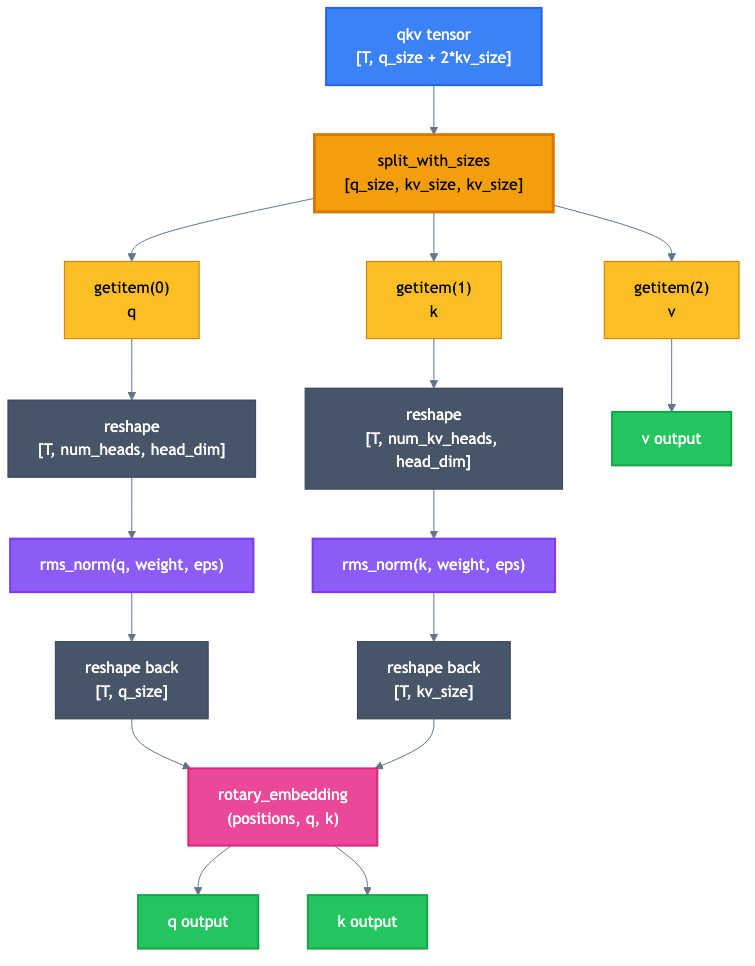
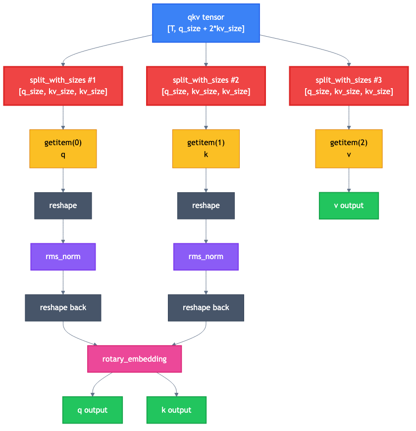
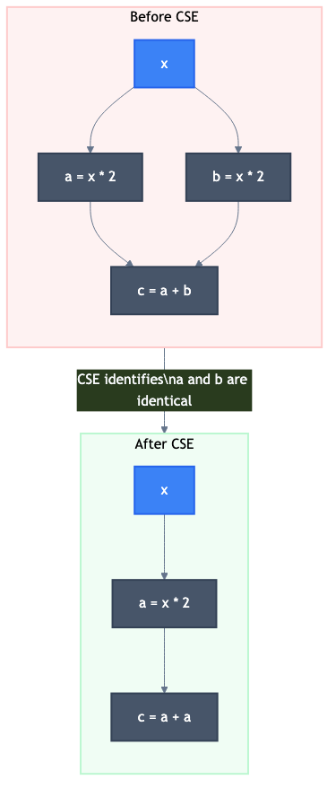

# FX graphs: the language of PyTorch compiler passes

## What is an FX graph?

An FX graph is PyTorch's intermediate representation (IR) for
compiled programs. When `torch.compile` traces your model, it
produces an FX graph that describes every tensor operation as a
node in a directed acyclic graph (DAG).

Think of it as a flowchart for math. Instead of step-by-step
Python code, you get a graph where data flows from inputs through
operations to outputs.

## Anatomy of a node

Every node in an FX graph has these properties:

```python
node.op       # The type of operation:
              #   "placeholder"     = function input
              #   "call_function"   = a function call (torch.add, etc.)
              #   "call_method"     = a method call (tensor.view, etc.)
              #   "call_module"     = calling a nn.Module
              #   "get_attr"        = accessing a module attribute
              #   "output"          = function return value

node.target   # What specifically to call:
              #   torch.ops.aten.split_with_sizes.default
              #   operator.getitem
              #   etc.

node.args     # Positional arguments (other nodes, or constants)
node.kwargs   # Keyword arguments

node.users    # Dict of nodes that USE this node's output
              # (who reads this node's result)

node.meta     # Metadata: tensor shapes, dtypes, etc.
```

## Example: tracing a simple split

Consider this Python code:

```python
def forward(self, qkv):
    q, k, v = qkv.split([2048, 512, 512], dim=-1)
    return q, k, v
```

After tracing, the FX graph looks roughly like:

```
%qkv : [T, 3072]                      # placeholder
%split = split_with_sizes(%qkv, [2048, 512, 512], dim=-1)
%q = getitem(%split, 0)               # q = first chunk
%k = getitem(%split, 1)               # k = second chunk
%v = getitem(%split, 2)               # v = third chunk
return (%q, %k, %v)
```

Each `%name` is a node. Notice that `split_with_sizes` does not
return three tensors directly. Instead, it returns one "tuple-
like" result, and three separate `getitem` nodes extract the
individual pieces. This is how PyTorch's functional IR represents
tuple unpacking.

The **user relationships** are:

- `%split` has 3 users: `%q`, `%k`, `%v`
- `%qkv` has 1 user: `%split`
- `%q`, `%k`, `%v` each have 1 user: the `return` node

## The normal graph for QK norm + RoPE

When a model does this:

```python
q, k, v = qkv.split([q_size, kv_size, kv_size], dim=-1)
q = rms_norm(reshape(q))
k = rms_norm(reshape(k))
q, k = rotary_embedding(positions, q, k)
```

The resulting FX graph has one `split_with_sizes` node with three
`getitem` users:



This is the structure that the `QKNormRoPEFusionPass` pattern
matcher expects to see. It looks for exactly this tree shape: one
split feeding into the q-path, k-path, and v-path.

## The broken graph (B200 + FP8)

On NVIDIA B200 GPUs with FP8 quantization, PyTorch's Inductor
produces a *different* graph for the same Python code. Instead of
one split node with three users, it creates three separate split
nodes, each with one user:



The math is identical -- all three splits read the same input
tensor and use the same split sizes. But the graph *structure* is
different. This is the core of the bug.

## Why does this happen?

The answer lies in how `torch.compile`'s optimization passes
interact with each other on different hardware.

### What is CSE?

**Common Subexpression Elimination (CSE)** is a standard compiler
optimization. If the same computation appears multiple times, CSE
replaces the duplicates with references to a single computation:



PyTorch's Inductor has a CSE pass built in. Normally, it would
detect that three identical `split_with_sizes` calls on the same
tensor with the same sizes are redundant and merge them into one.

### Why CSE fails here

On B200 + FP8, the combination of FP8 quantization lowering and
Inductor's internal pass ordering produces a graph where the three
split nodes are *structurally* present but CSE does not merge
them. This is tracked as PyTorch issue #174472.

The exact mechanism is complex and involves how Inductor's
decomposition passes lower FP8 operations, which creates the
splits at a stage where CSE has already run. The key insight is:
**you cannot rely on upstream compiler passes to always normalize
graph shapes identically across all hardware/dtype
configurations.**

## Navigating FX graphs in code

When writing or reading compiler passes, you work with the
`torch.fx.Graph` and `torch.fx.Node` classes.

### Iterating nodes

```python
for node in graph.nodes:
    # Nodes are visited in topological order
    # (every node appears after all its inputs)
    print(node.op, node.target, node.args)
```

### Checking node type

The vLLM codebase provides a helper function `is_func`:

```python
from vllm.compilation.passes.fx_utils import is_func

# Check if a node is a specific function call
if is_func(node, torch.ops.aten.split_with_sizes.default):
    print("Found a split_with_sizes!")

# Check for getitem
if is_func(node, operator.getitem):
    index = node.args[1]  # which element is being extracted
```

Under the hood, `is_func` is simple:

```python
def is_func(node, target):
    return node.op == "call_function" and node.target == target
```

### Reading arguments

```python
# For split_with_sizes(input, [sizes], dim)
arg_node = node.args[0]    # The input tensor (another node)
split_sizes = node.args[1] # The sizes list, e.g. [2048, 512, 512]
dim = node.args[2]         # The dimension to split on
```

### Checking users

```python
# Who uses this node's output?
for user in node.users:
    print(f"  Used by: {user.op} {user.target}")

# How many users?
num_users = len(node.users)
```

### Modifying the graph

Two key operations for rewriting:

```python
# Replace all uses of `old_node` with `new_node`
# Every node that reads from old_node now reads from new_node
old_node.replace_all_uses_with(new_node)

# Remove a node from the graph
# (only works if the node has zero users)
graph.erase_node(old_node)
```

These are the exact two operations our `SplitCoalescingPass` uses
to merge duplicate split nodes.

## The `meta` dictionary

Every node carries a `meta` dictionary with rich information:

```python
node.meta["val"]          # A FakeTensor with shape/dtype info
node.meta["val"].shape    # e.g., torch.Size([5, 2048])
node.meta["val"].dtype    # e.g., torch.bfloat16
```

This metadata is produced during tracing and is used by passes
to make decisions based on tensor properties. For example, the
`NoOpEliminationPass` compares input and output shapes to decide
if a reshape is a no-op.

## Further reading

- `03-kernel-fusion-and-the-split-coalescing-fix.md` -- how the
  coalescing pass uses these concepts
- PyTorch FX documentation:
  https://docs.pytorch.org/docs/stable/fx.html
