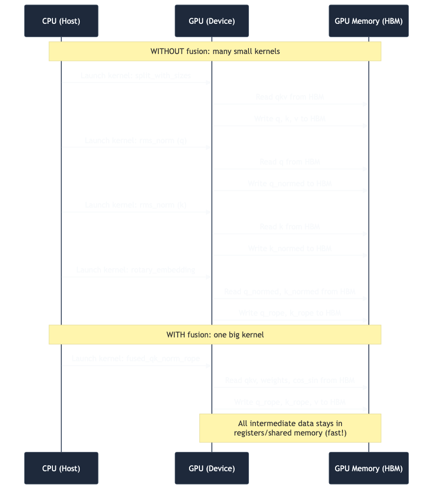
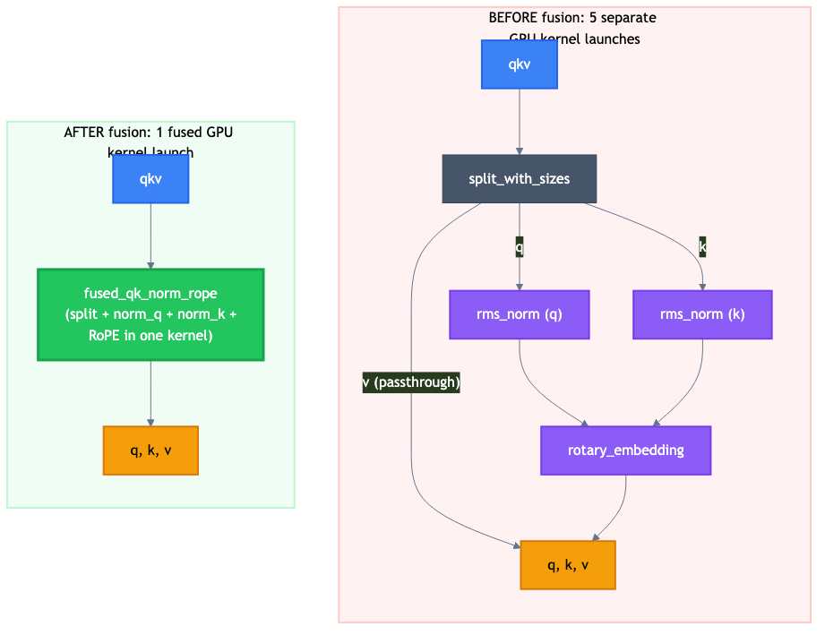
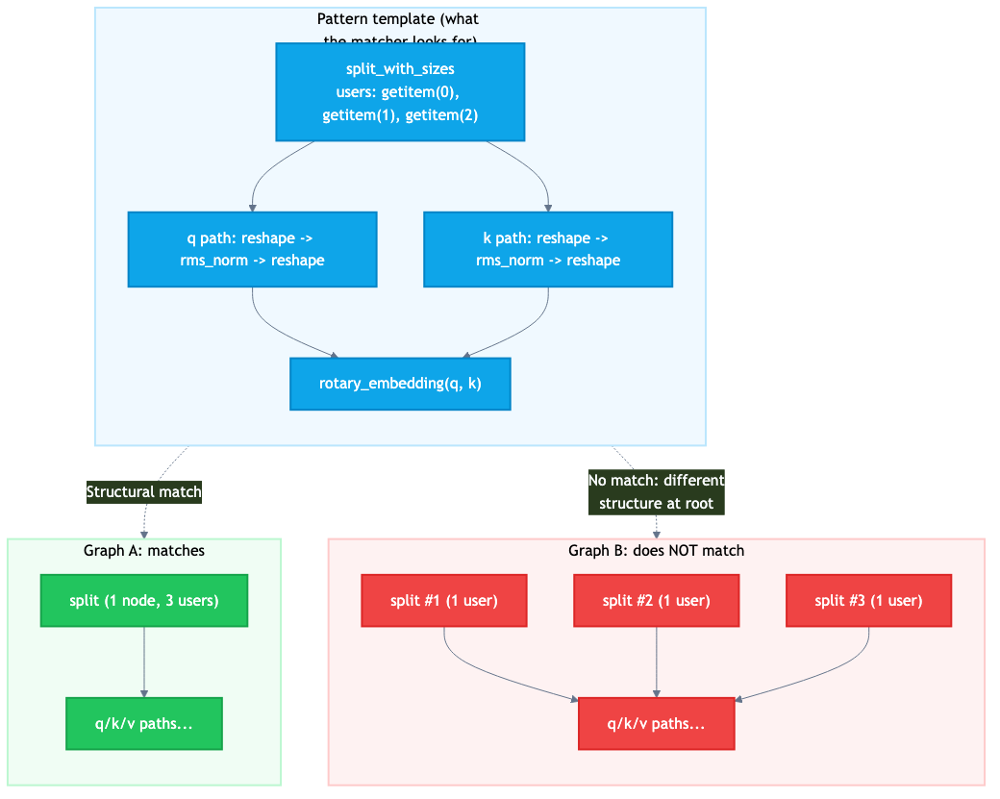
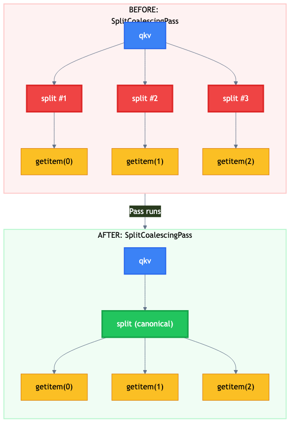
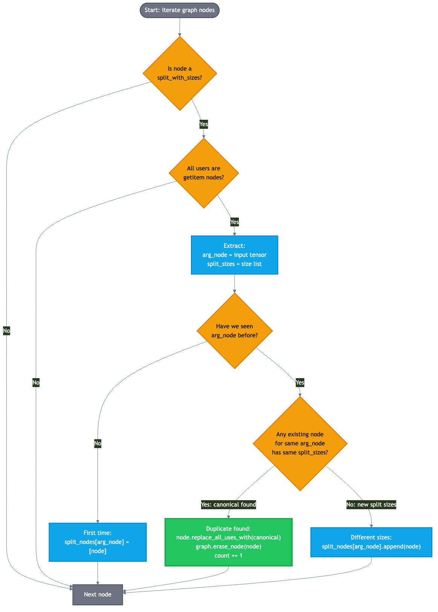
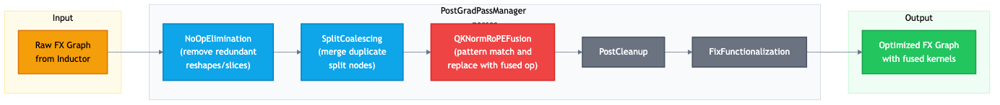

# Kernel fusion and the split coalescing fix

## Prerequisites

Read these first:

1. `01-torch-compile-pipeline.md` -- how Python becomes GPU code
2. `02-fx-graphs-deep-dive.md` -- how FX graphs work

## What is kernel fusion?

Every distinct operation on the GPU runs as a **kernel** -- a
function that executes across thousands of GPU threads in
parallel. When you run `rms_norm(q)` followed by
`rotary_embedding(q, k)`, that is two kernel launches.

Each kernel launch involves:

1. **CPU-side overhead**: the CPU prepares launch parameters and
   tells the GPU what to do (~5-10 microseconds).
2. **Memory round-trip**: the kernel reads inputs from GPU global
   memory (HBM), computes, and writes results back to HBM.
3. **Synchronization**: the next kernel cannot start until the
   previous one finishes writing (in the same CUDA stream).

**Kernel fusion** combines multiple kernels into one. The fused
kernel reads inputs once, does all the math with intermediate
values kept in fast on-chip memory (registers and shared memory,
which are 10-100x faster than HBM), and writes the final output
once.



## The QK norm + RoPE fusion

In transformer attention blocks with QK normalization (used in
models like Qwen3), the following operations happen in sequence:

1. **Split** the combined QKV tensor into Q, K, V
2. **Reshape** Q and K to per-head layout
3. **RMSNorm** on Q heads
4. **RMSNorm** on K heads
5. **Reshape** back to flat layout
6. **RoPE** (rotary positional embedding) on Q and K

Without fusion, that is roughly 5 kernel launches (split is often
folded into addressing, but the norms and RoPE are real kernels).

vLLM's `QKNormRoPEFusionPass` fuses all of this into a single
custom CUDA kernel called `fused_qk_norm_rope`:



## How pattern matching works

The fusion pass uses PyTorch Inductor's **pattern matcher**. You
define two functions:

1. **Pattern**: a function that demonstrates the unfused
   computation.
2. **Replacement**: a function that demonstrates the fused
   computation.

```python
def pattern(qkv, positions, q_weight, k_weight, cos_sin_cache):
    q, k, v = qkv.split([q_size, kv_size, kv_size], dim=-1)
    # ... reshape, rms_norm, reshape, rotary_embedding ...
    return q_rope, k_rope, v

def replacement(qkv, positions, q_weight, k_weight, cos_sin_cache):
    result = fused_qk_norm_rope(qkv, ...)
    return result.split([q_size, kv_size, kv_size], dim=-1)
```

PyTorch traces both functions into FX graphs, then searches the
compiled model's graph for subgraphs that match the pattern's
structure. When found, it replaces the matched subgraph with the
replacement.

This matching is **structural** -- it does not just check that
the math is equivalent. It checks that the exact same sequence of
operations appears with the exact same graph topology (same
number of nodes, same edges, same user counts).



## The bug: B200 + FP8 breaks pattern matching

On NVIDIA B200 GPUs with FP8 quantization, the compiled FX graph
contains three separate `split_with_sizes` nodes instead of one:

```text
Normal (A100, H100, non-FP8):
  qkv -> split_with_sizes (3 users: getitem 0, 1, 2)

Broken (B200 + FP8):
  qkv -> split_with_sizes #1 (1 user: getitem 0)  -> q
  qkv -> split_with_sizes #2 (1 user: getitem 1)  -> k
  qkv -> split_with_sizes #3 (1 user: getitem 2)  -> v
```

The pattern matcher expects one split node with three users. It
sees three split nodes with one user each. No match. Fusion does
not happen. The model runs slower.

The math is identical. The semantics are identical. But the graph
shape is different, and pattern matching is shape-sensitive.

This happens because PyTorch's built-in CSE (common subexpression
elimination) pass fails to merge the three splits. The FP8
quantization lowering creates them at a point in the compilation
pipeline where CSE has already run. See PyTorch issue #174472.

## The fix: SplitCoalescingPass

Our fix is a new compiler pass called `SplitCoalescingPass` that
runs *before* the fusion pass. It normalizes the graph by merging
duplicate `split_with_sizes` nodes:



### The algorithm



The pass walks through every node in the graph and:

1. **Filters** to only `split_with_sizes` nodes whose users are
   all `getitem` nodes.
2. **Groups** by input tensor: if two splits read from the same
   tensor, they are candidates for merging.
3. **Matches** by split sizes: within a group, if two splits have
   the same sizes list, one is a duplicate.
4. **Replaces**: the duplicate's users are redirected to the
   canonical (first-seen) node, and the duplicate is erased.

### The code, annotated

Here is the complete pass with detailed annotations:

```python
class SplitCoalescingPass(VllmInductorPass):

    @VllmInductorPass.time_and_log
    def __call__(self, graph: fx.Graph) -> None:
        count = 0

        # This dict maps each input tensor node to a list of
        # split_with_sizes nodes that read from it.
        # If two splits read the same tensor AND have the same
        # sizes, one is a duplicate of the other.
        split_nodes: dict[fx.Node, list[fx.Node]] = {}

        # Walk every node in topological order
        for node in graph.nodes:

            # Only look at split_with_sizes calls
            if not is_func(
                node, torch.ops.aten.split_with_sizes.default
            ):
                continue

            # Safety check: only process splits whose outputs
            # are consumed exclusively by getitem nodes.
            # This avoids touching splits used in unexpected ways.
            if not all(
                is_func(user, operator.getitem)
                for user in node.users
            ):
                continue

            # Extract the input tensor and the sizes list
            # node.args[0] is the tensor being split
            # node.args[1] is the list of sizes, e.g. [2048,512,512]
            arg_node, split_sizes = node.args[:2]

            # First time seeing a split on this tensor?
            # Record it and move on.
            if arg_node not in split_nodes:
                split_nodes[arg_node] = [node]
                continue

            # We have seen splits on this tensor before.
            # Check if any existing one has the same sizes.
            canonical = next(
                (
                    n
                    for n in split_nodes[arg_node]
                    if list(n.args[1]) == list(split_sizes)
                ),
                None,
            )

            if canonical is not None:
                # DUPLICATE FOUND!
                # Redirect everyone who reads from this node
                # to read from the canonical node instead.
                node.replace_all_uses_with(canonical)

                # Remove the now-unused duplicate from the graph.
                graph.erase_node(node)

                count += 1
            else:
                # Different sizes on the same tensor -- this is
                # a legitimately different split, keep it.
                split_nodes[arg_node].append(node)

        # Always log, even if count is 0, so we know the pass ran
        logger.debug(
            "Coalesced %d duplicate split_with_sizes nodes", count
        )
```

### Why `replace_all_uses_with` works

When we call `node.replace_all_uses_with(canonical)`, every
`getitem` that was reading from the duplicate now reads from the
canonical split instead. This is safe because:

1. Both splits read the same input tensor.
2. Both splits use the same sizes.
3. Therefore they produce identical outputs.
4. The `getitem` indices still refer to the same positions.

After replacement, the canonical split has more users (the
original users plus the redirected ones), which is exactly the
graph shape the fusion pattern matcher expects.

## Where the pass fits in the pipeline

The `PostGradPassManager` in `pass_manager.py` configures the
pass ordering:

```python
if self.pass_config.enable_qk_norm_rope_fusion:
    self.passes += [SplitCoalescingPass(config)]   # normalize first
    self.passes += [QKNormRoPEFusionPass(config)]   # then match+fuse
```

The order is critical:

1. `SplitCoalescingPass` merges duplicate splits into one.
2. `QKNormRoPEFusionPass` now sees the normalized graph and
   matches its pattern.

If you reversed the order, the fusion pass would run first, see
three separate splits, fail to match, and produce no fusion. The
coalescing pass would then clean up the splits (pointlessly, since
no fusion happened).



## The E2E impact

Before this fix, on B200 + FP8:

```
qk_norm_rope_fusion.py: Fused QK Norm+RoPE on 0 sites
```

After this fix:

```
split_coalescing.py: Coalesced 2 duplicate split_with_sizes nodes
qk_norm_rope_fusion.py: Fused QK Norm+RoPE on 1 sites
```

For the Qwen3-30B-A3B-FP8 model, this happens in every
transformer layer, so the total number of fused sites equals the
number of layers. The E2E test expected count was updated from
`0 if is_blackwell() else n_layers` to simply `n_layers`.

## Writing a compiler pass: structural patterns

Our `SplitCoalescingPass` follows the same structural pattern as
other vLLM utility passes (like `NoOpEliminationPass`):

1. **Extend `VllmInductorPass`**: gives you access to the pass
   config, timing/logging, and graph dumping.

2. **Decorate `__call__` with `@VllmInductorPass.time_and_log`**:
   automatically measures execution time, dumps before/after
   graphs for debugging.

3. **Walk `graph.nodes` in order**: nodes are in topological
   order, so every node's inputs have already been visited.

4. **Filter with `is_func`**: check `node.op` and `node.target`
   to find the operations you care about.

5. **Transform with `replace_all_uses_with` and
   `graph.erase_node`**: the standard two-step for graph
   rewriting.

6. **Log the count**: always report what you did, even if the
   answer is zero. This is invaluable for debugging.

## Testing compiler passes

### Unit testing (test_split_coalescing.py)

The unit test creates a minimal model that reproduces the broken
graph shape:

```python
class SplitCoalescingModel(torch.nn.Module):
    def forward(self, qkv):
        q, _, _ = qkv.split([q_size, kv_size, kv_size], dim=-1)
        _, k, _ = qkv.split([q_size, kv_size, kv_size], dim=-1)
        _, _, v = qkv.split([q_size, kv_size, kv_size], dim=-1)
        return q + 1, k + 2, v + 3
```

Three separate splits on the same tensor. After the pass, only
one should remain. The test verifies two things:

1. **Correctness**: compiled output matches eager execution.
2. **Structural effect**: `backend.op_count(split_with_sizes)`
   returns 1.

### Integration testing (test_qk_norm_rope_fusion.py)

The fusion test uses a `scattered_split` parameter to test both
graph shapes:

```python
@pytest.mark.parametrize("scattered_split", [True, False])
def test_qk_norm_rope_fusion(..., scattered_split):
    model = QKNormRoPETestModel(
        ...,
        test_scattered_split=scattered_split,
    )
```

When `scattered_split=True`, the model produces three separate
splits (simulating B200+FP8). The `SplitCoalescingPass` merges
them, and the fusion pass still matches. The test verifies that
fusion succeeds in both cases.

### E2E testing (tests/compile/fusions_e2e/)

The E2E tests run actual models end-to-end with all passes
enabled and check the fusion counts from log output. For
Qwen3-30B-A3B-FP8, the expected `norm_rope_fusion` count is now
`n_layers` on all platforms, including Blackwell.

## Key takeaways

1. **Graph shape matters**: pattern matchers are structural, not
   semantic. Two mathematically equivalent graphs may not match if
   their topology differs.

2. **Upstream passes are not guaranteed**: do not assume that
   CSE, constant folding, or other built-in passes will always
   normalize the graph the way you expect. Different
   hardware/dtype combinations can produce different graph shapes.

3. **Canonicalization before matching**: when writing a pattern-
   matching pass, consider whether a normalization pass should run
   first to handle graph-shape variance.

4. **Separate concerns**: the coalescing logic is a standalone
   pass, not embedded in the fusion pass. This makes both passes
   simpler, independently testable, and reusable. If a future
   fusion pass also needs canonical splits, it gets them for free.

5. **The pass pipeline is an ordered pipeline**: ordering
   matters. Canonicalization must precede the passes that depend
   on it.

## Glossary

| Term | Definition |
|------|-----------|
| **FX graph** | PyTorch's intermediate representation for compiled programs; a DAG of tensor operations |
| **Node** | A single operation in an FX graph (function call, input, output) |
| **User** | A node that reads another node's output |
| **CSE** | Common Subexpression Elimination; a compiler optimization that merges identical computations |
| **HBM** | High Bandwidth Memory; the GPU's main memory (slow compared to registers/shared memory) |
| **Kernel** | A function that runs on the GPU across many parallel threads |
| **Kernel fusion** | Combining multiple kernels into one to reduce memory traffic and launch overhead |
| **RMSNorm** | Root Mean Square Layer Normalization; a normalization technique used in transformers |
| **RoPE** | Rotary Positional Embedding; encodes token position into attention Q and K vectors |
| **Pattern matcher** | Inductor's system for finding and replacing subgraph patterns |
| **Inductor** | PyTorch's default compiler backend that generates GPU code |
| **TorchDynamo** | PyTorch's bytecode tracer that captures operations into an FX graph |
| **B200** | NVIDIA Blackwell architecture GPU (compute capability 10.x) |
| **FP8** | 8-bit floating point; a low-precision format that reduces memory usage and increases throughput |
| **Canonicalization** | Transforming a graph into a standard form so that downstream passes see consistent shapes |
| **Coalescing** | Merging multiple equivalent nodes into a single canonical node |
